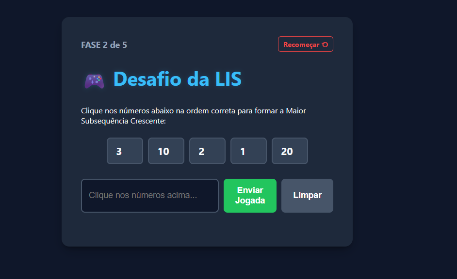
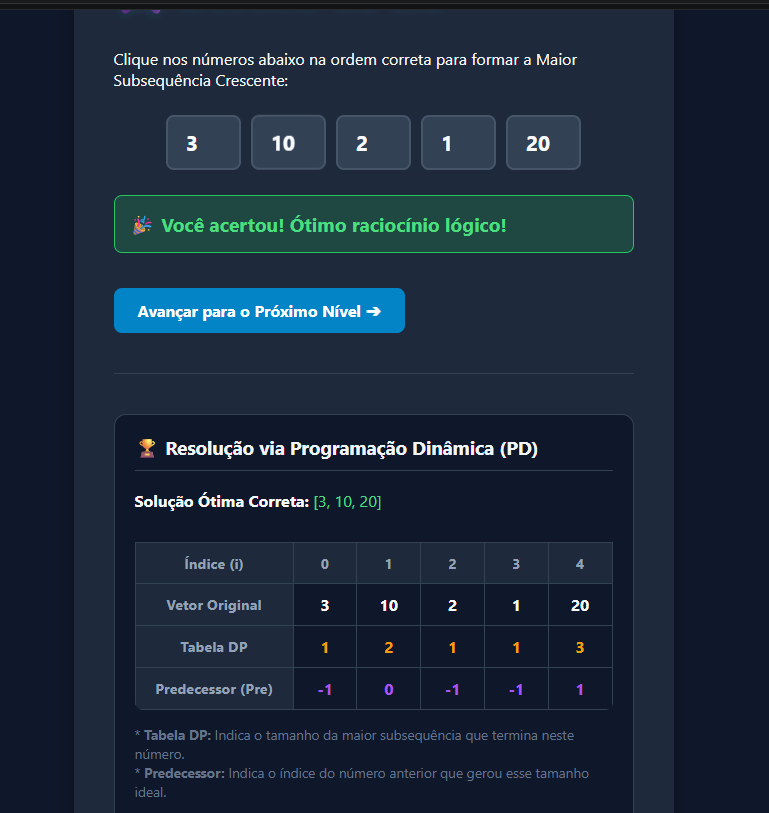

# Lis

Número da Lista: 50<br>
Conteúdo da Disciplina: Programação dinâmica<br>

## Aluno
| Matrícula | Aluno |
| -- | -- |
| 21/1031790 | Oscar de Brito |
| 21/1063013 | Renata Quadros Kurzawa |

## Vídeo de Apresentação
link: https://youtu.be/RhVX0ev4jfg

[](https://youtu.be/RhVX0ev4jfg)


## Sobre
Este projeto é um jogo educativo em Flask para treinar Programação Dinâmica usando o problema da Maior Subsequência Crescente (LIS).

O jogador recebe sequências de números e precisa montar a subsequência crescente correta. A aplicação calcula a solução ótima, compara com a resposta enviada e exibe a tabela de Programação Dinâmica para reforçar o aprendizado.

## Estrutura do Projeto
- `app.py`: ponto de entrada da aplicação, rotas do jogo e controle das fases.
- `algoritmos/lis.py`: implementação da LIS com Programação Dinâmica.
- `templates/index.html`: tela principal do jogo.
- `templates/fim.html`: tela final quando todas as fases são concluídas.
- `static/style.css`: estilos visuais da interface.
- `requirements.txt`: dependências do projeto.

## Screenshots





## Instalação
1. Crie e ative um ambiente virtual.
2. Instale as dependências com:

```bash
pip install -r requirements.txt
```

3. Execute a aplicação:

```bash
python app.py
```

4. Abra o navegador em `http://127.0.0.1:5000`.

## Fluxo do jogo:
1. O usuário acessa a página inicial.
2. A aplicação carrega a fase atual e mostra a sequência de números.
3. O jogador seleciona os números que acredita formarem a maior subsequência crescente.
4. Ao enviar a resposta, o sistema compara a tentativa com a solução correta.
5. Se acertar, o jogador avança para a próxima fase.
6. Quando todas as fases terminam, o sistema exibe a tela final.

